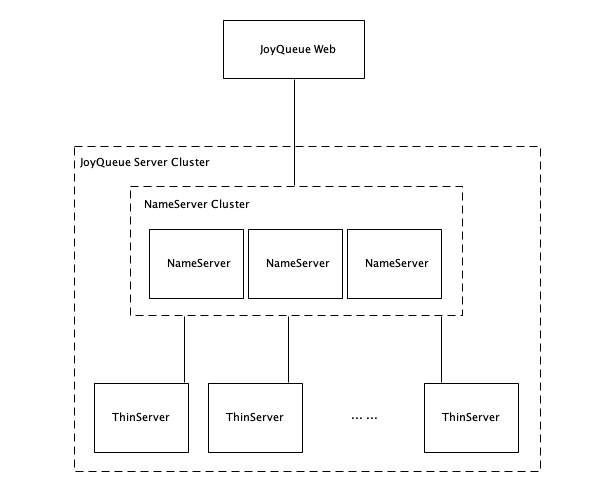

# JoyQueue 集群部署

JoyQueue支持集群部署。不同于其它的消息平台，JoyQueue在集群部署时，不需要依赖任何外部服务，只需要通过简单的配置即可实现可靠的大规模集群。

## 元数据服务

JoyQueue Server内置元数据服务（也叫NameServer或NameService），元数据存储在每个节点的本地磁盘上。JoyQueue Server可以以server或者thin两种模式启动，以server模式启动的节点提供元数据服务，存储元数据；以thin模式启动的节点只访问元数据，不存储元数据。

只要提供元数据服务的节点中，超过半数以上的节点存活，集群就可以持续提供服务。建议一个集群内NameServer节点（nameserver.nsr.name = server）配置为3个或者5个，其它节点配置为thin模式（nameserver.nsr.name = thin ）, 即ThinServer。无论是NameServer还是ThinServer都可以提供收发消息的服务。



## 配置集群

例如，配置5个节点的集群，其中3个NameServer，2个ThinServer。

| IP | 类型 |
| -- | -- |
| 192.168.1.1 | NameServer |
| 192.168.1.2 | NameServer |
| 192.168.1.3 | NameServer |
| 192.168.1.4 | ThinServer |
| 192.168.1.5 | ThinServer |


所有的NameServer中，需要配置属性`nameserver.ignite.discoverySpi.ipFinder.address`来互相发现。NameServer需要在配置文件joyqueue.properties中配置：

```properties
nameserver.nsr.name=server
# 如果不配置端口，使用默认的发现端口
nameserver.ignite.discoverySpi.ipFinder.address=192.168.1.1,192.168.1.2,192.168.1.3
```

ThinServer中，需要配置NameServer的元数据服务地址和端口`nameservice.serverAddress`用于访问元数据服务。ThinServer需要在配置文件joyqueue.properties中配置：

```properties
nameserver.nsr.name=thin
nameservice.serverAddress=192.168.1.1:50092,192.168.1.2:50092,192.168.1.3:50092
```

对应的JoyQueue Web需要在配置文件application.properties中配置：

```properties
joyqueue.servers=192.168.1.1,192.168.1.2,192.168.1.3
```

配置成功后，可以打开JoyQueue Web，在“系统管理-Broker管理”中看到集群中所有的节点。
