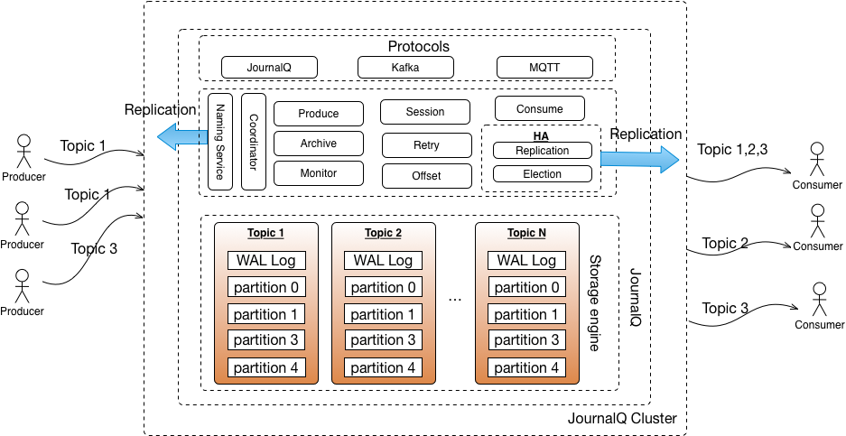

# Architecture overview
JournalQ is a multi-protocols and distributed pub/sub messaging broker,consist of several modules,including Protocol,Poducer,Consumer,Storage engine,HA and Naming service et.

Generally,topic consists of several partition groups,which contains multiple partitions,and partition groups of the topic will distribute among more than one brokers,which is helpful for Horizontally scale. Partition group cluster is made up of the same parttion group on different broker,and only leader of the partition group can handle produce/consume message requests.

Naming service keeps topic,app and pub/sub metadata,such as pub/sub relationship between topic and app.The metadata replicates among JournalQ instances.

Key modules of JournalQ are showed in below:

## Broker Cluster

JournalQ instance is responsible for messages store,produce and consume. In addition,Archive,Retry,HA and full-featured monitor are provided for production ready.

Retry module enable consumer to drop or temporarily skip the message and consume it later,e.g.,unexpected message format which can't be recognized by consumer leads consumer stuck.
JournalQ instance's storage is always limited by disk space,archive module can archive the consumed message to a larger storage,such as HDFS,with clean up strategies,and then you may look up and download a message which is produced a month ago. Monitor module manages realtime monitoring data,such as pending,retry,enqueue, dequeue and connections,which is intutive and helpful to know what happening.HA module consist of election and replication, manages followers and replicates messages to them, and a new leader will be elected among alive followers when current leader crashed,raft-based election algorithm is employed by JournalQ.

## Naming Cluster

Naming service enable every JorunalQ instance can provide service discovery and metadata,and it's a embedded ignite,which replicates metadata among cluster instances.  

## Producer Cluster

Producer may be interested in one or more topics,and several Producers could have the same topic. Distributed producers could employ default or self-defined partition selector to load balance messages to broker cluster.

## Consumer Cluster

Consumer may be interested in one or more topics,and several consumers could have the same topic, JournalQ supports group consume or broadcast.Group consume indicates that per message will only be consumed by one of consumer in the group,JournalQ adopted a load balance algorithm to coordinate consumer to target partition. Broadcast means all the consumer will consume the complete messages of the topic, which implements by controlling consume offset on local.
